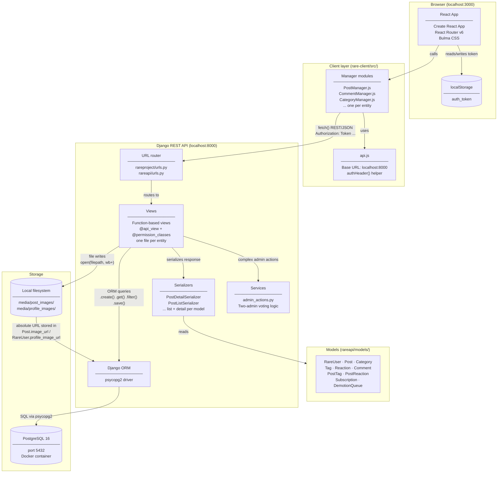

# Rare — System Architecture

## Component notes

| Component | What it is |
|---|---|
| **React App** | Single-page app bootstrapped with Create React App. Routing handled by React Router v6. No state management library — local `useState`/`useRef` only. |
| **Manager modules** | Thin `fetch()` wrappers, one file per entity. All auth headers assembled by `api.js`. No error handling — failed requests are silent. |
| **URL router** | Standard Django URL conf. `rareproject/urls.py` mounts all API routes under `/`; `rareapi/urls.py` defines every individual path. No trailing slashes. |
| **Views** | Function-based DRF views. Each function handles multiple HTTP methods via `if request.method`. Auth enforced by `@permission_classes([IsAuthenticated])`; admin-only paths check `request.user.is_staff` manually. |
| **Services** | `admin_actions.py` only. Implements two-admin approval for demoting or deactivating another admin — first call queues (202), second call executes (204). All other logic lives directly in views. |
| **Serializers** | Two per model: a slim `*ListSerializer` for collection endpoints and a full `*DetailSerializer` for single-resource and mutation responses. |
| **PostgreSQL** | Runs in Docker (see `docker-compose.yml`). Django ORM handles all reads and writes via `psycopg2`. |
| **Local filesystem** | Image uploads are written to disk with `open()`. URLs are absolute (`request.build_absolute_uri`), so they break on redeploy or behind a load balancer. |
