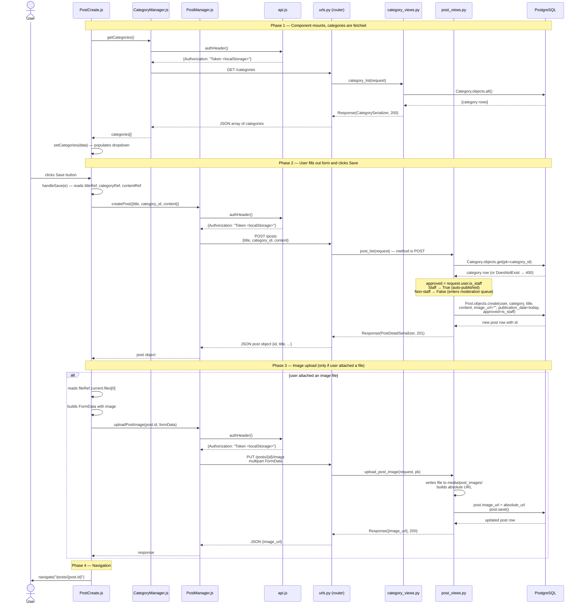

# Sequence Diagram — User Creates a Post

> Traced from the source files. Key files involved:
> `PostCreate.js` · `CategoryManager.js` · `PostManager.js` · `api.js`
> `rareapi/urls.py` · `post_views.py` · `category_views.py` · PostgreSQL

## Key points

| What | Where it happens |
|---|---|
| Auth token is attached | `api.js` → `authHeader()` reads `localStorage.getItem("auth_token")` and returns the header. Neither the component nor the manager constructs it. |
| `approved` is decided server-side | `post_views.py` line 33: `approved=request.user.is_staff`. The client never sends this field. |
| `publication_date` is always today | `post_views.py` sets it via `timezone.now().date()`. The client cannot schedule a future post. |
| Image upload is a second HTTP request | If a file is attached, `PostCreate.js` calls `uploadPostImage()` only after `createPost()` resolves. If the second call fails, the post exists without an image and no error is shown. |
| Category list is fetched on mount | `useEffect(() => { getCategories().then(setCategories) }, [])` in `PostCreate.js`. The form is rendered immediately but the dropdown is empty until this resolves. |
