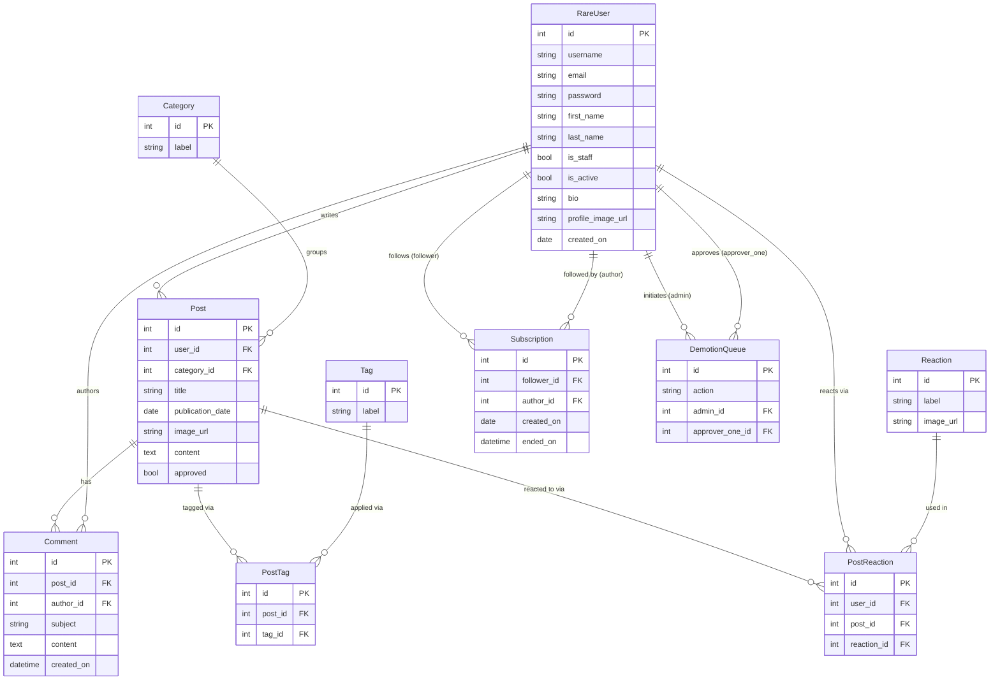

# Rare — Database Schema

> Generated from the model files in `rareapi/models/`. See that directory for the authoritative source.

## Notes

- **RareUser** extends Django's built-in `AbstractUser`. The fields `username`, `email`, `password`, `first_name`, `last_name`, `is_staff`, and `is_active` are inherited — they are not declared in `rare_user.py` but do exist as database columns.
- **PostTag** and **PostReaction** are explicit join tables rather than Django `ManyToManyField` declarations. This gives the views direct ORM access to the join rows (e.g. to delete all tags for a post before replacing them).
- **Subscription.ended_on** is nullable. A subscription with `ended_on=NULL` is active; one with a value has been cancelled. Rows are never deleted — only soft-closed.
- **DemotionQueue** implements a two-admin voting system. `action` is a string key like `deactivate:42` or `demote:7`. A `unique_together` constraint on `(action, admin, approver_one)` prevents the same admin from voting twice. See `rareapi/services/admin_actions.py` for the full logic.
